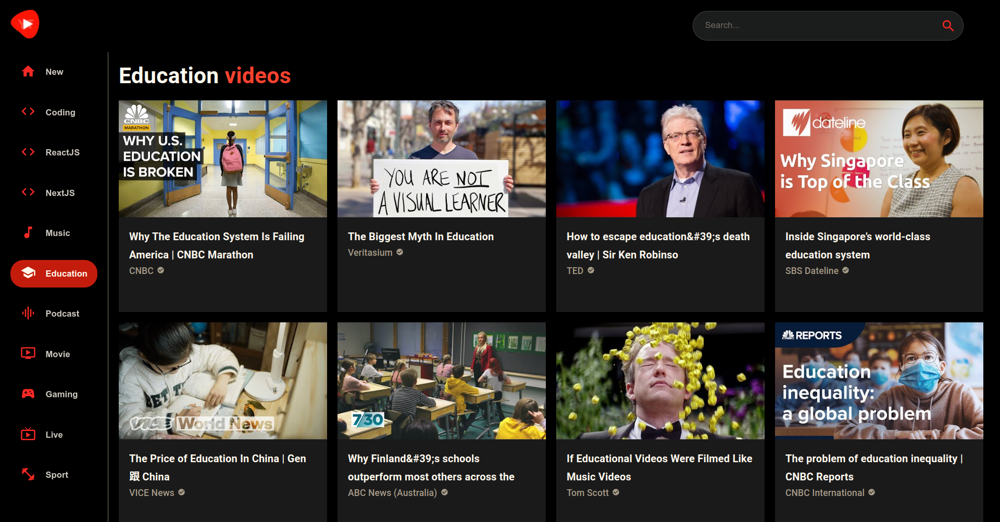

# Youtube Video Platform
[demo](https://kushaj-youtube-video-platform.vercel.app/)



- Developed and deployed a YouTube clone application on Vercel in React/Next.js and TypeScript, leveraging Material UI for a visually appealing and responsive design, and using RapidAPI to access YouTube v3 API endpoints for fetching video and channel data.
- Acquired expertise in React functional components and their reusability, efficient file and folder structure, and mastery of Material UI, enabling the ability to build any API-driven web application.
- Ensured optimal responsiveness across devices using well-crafted media queries, and utilized RapidAPI Vscode extension for API testing, demonstrating proficiency in creating a seamless, fully-functional video browsing experience.

## Table of Contents
- [Demo Videos](#demo-videos)
    - [Search videos](#search-videos)
    - [Search by Categories](#search-by-categories)
    - [View channels](#view-channels)
    - [Fully responsive](#fully-responsive)
- [Dependencies](#dependencies)
- [Local Setup](#local-setup)
- [Directory Setup](#directory-setup)
- [License](#license)

## Demo Videos

### Search Videos
Search for your favorite videos and play them straight from the app. You can also see related videos and the number of views/likes on the video and visit the channel page to view other videos by the creator.

https://user-images.githubusercontent.com/24699564/196017941-20e9219f-76f0-417b-8f80-f7535fe61409.mp4

### Search By Categories
To find new videos from prespecified categories you can click on one of the category in the sidebar.

https://user-images.githubusercontent.com/24699564/196017946-f83032b2-25f2-4071-b3f1-d5f8e7c18f3d.mp4

### View channels
You can search for youtube channels, see their subscribers, videos uploaded by them on a custom channel page.

https://user-images.githubusercontent.com/24699564/196017952-67b6cb20-1674-488b-bff3-ae27cf67aaa1.mp4

### Fully responsive
All the pages including the home page, video page, channel page are fully-responsive.

https://user-images.githubusercontent.com/24699564/196017960-e8e51ea1-f7d3-46c8-9112-2132140df5b4.mp4

## Dependencies
- [React](https://reactjs.org/)
- [Next.js](https://nextjs.org/)
- [TypeScript](https://www.typescriptlang.org/)
- [MUI5](https://mui.com/)
- [ReactPlayer](https://github.com/CookPete/react-player)
- [Axios](https://axios-http.com/docs/intro)
- [RapidAPI Youtube v3](https://rapidapi.com/ytdlfree/api/youtube-v31/)

## Local Setup
**Step 1**. Setup Node.js v16.17.1. [nvm](https://github.com/nvm-sh/nvm) can be used to quickly setup Node.js (and you can also have multiple versions of Node.js).
```
curl -o- https://raw.githubusercontent.com/nvm-sh/nvm/v0.39.1/install.sh | bash
nvm install 16.17.1
```

**Step 2**. Clone the repository and install all the dependencies.
```
git clone https://github.com/KushajveerSingh/youtube_video_platform.git
cd youtube_video_platform
npm install --legacy-peer-deps
```

`--legacy-peer-deps` would install the exact packages as used in the repository. The repository already includes VSCode and Prettier setup, and you can modify the default behavior in `.vscode/settings.json` and `.prettierrc` respectively.

**Step 3**. Create `.env.local` and copy the contents from `.env.example` to `.env.local`.
- `NEXT_PUBLIC_BASE_URL` - set to `http://localhost:3000/` during development and when you deploy the project on Vercel, set it to the domain where the project is hosted.
- `NEXT_PUBLIC_RAPID_API_KEY` - Goto [RapidAPI Youtube v3](https://rapidapi.com/ytdlfree/api/youtube-v31/) and create a new account. After creating an account, you can click **Subscribe to Test** and this would generate the API key for you.

**Step 4**. Run `npm run dev` to start the local development server at `localhost:3000`. Now you can customize the application as per your needs. Further, look at [Directory Setup](#directory-setup) section to understand how the source code is structured.

**Step 5**. After making the desired changes, you can push your project to GitHub and you are ready for deployment on [Vercel](https://vercel.com/)

**Step 6**. Create an account on [Vercel](https://vercel.com/) and then click **Add New...** -> **Project** and choose your github repository.

And that is it. You have successfully deployed your custom youtube application.

## Directory Setup

- `public`
    - `favicon.ico` - provide your custom favicon here
    - `manifest.json` - the default behavior allows all the files in the repository to be scrapped by the bots
    - `youtube_logo.png` - provide your custom logo image here
- `src`
    - `global.css` - global css classes are defined here. This file is then loaded in `src/pages/_app.tsx`.
    - `utils`
        - `apiTypes.ts` - TypeScript types for the objects returned from the Youtube API. This file is generated using [VSCode RapidAPI Extension](https://rapidapi.com/guides/put-api-development-at-ease-with-rapidapi-client-for-vs-code) and if you want to include additional features of the Youtube API, then you can define the types for them in this file.
        - `categories.tsx` - List of the items in the category section on the left side of the application. Like \[New, Coding, Music, Education, Sport, ...]
        - `fetchFromAPI.ts` - uses axios to fetch data from the API. Use this file to provide custom options needed by the Youtube API, like max results.
        - `createEmotionCache.ts` - Used to setup emotion server to be used with Material-UI. You do not have to edit this file.
    - `components`
        - `Navbar.tsx` - Define the logo on top-left and search bar (from `SearchBar.tsx`) on top-right. This is used as default layout in `src/pages/_app.tsx` for all the pages.
        - `SearchBar.tsx` - Logic to search for videos and redirect the user to `src/pages/search/[searchTerm].tsx`
        - `Feed.tsx`- Loads the Sidebar on the left (from `Sidebar.tsx`) and the video feed (from `Videos.tsx`
        - `Sidebar.tsx` - Load the categories from `src/utils/categories.tsx` and show then on the left side of the page
        - `Videos.tsx` - Show the videos for the current search term or for the current category. Uses `VideoCard.tsx` and `ChannelCard.tsx` internally
        - `VideoCard.tsx` - Render the video card. This includes showing the thumbnail, title, channel that posted the video. You can extend this to include things like the number of likes and views on the video
        - `ChannelCard.tsx` - Render the channel card. Show the channel profile picture, number of subscribers
    - `pages`
        - `_app.tsx` - Used by Next.js to define the default layout for all the pages. You don't need to modify it.
        - `_document.tsx` - Used by Next.js to define the default HTML that should be loaded for every page. Modify the meta tags to be rendered on every page. Further you can put meta tags into a different component and render then individually for every page.
        - `_index.tsx` - Renders root page `/` by adding the `Feed.tsx` component
        - `channel/[id].tsx` - channel page. Show the videos uploaded by a specific channel.
        - `video/[id.tsx]` - Play the video and show related videos
        - `search/[searchTerm].tsx` - Show the videos/channels related to the current search term

## License
This application has Apache License Version 2.0, as found in the [LICENSE](./LICENSE) file.
